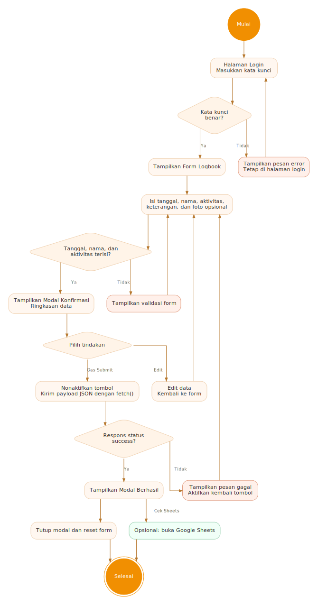
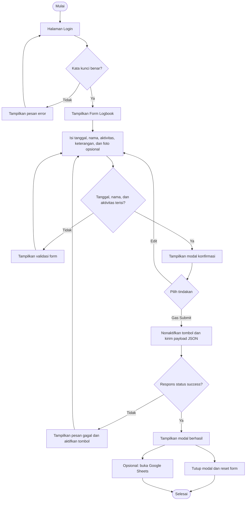
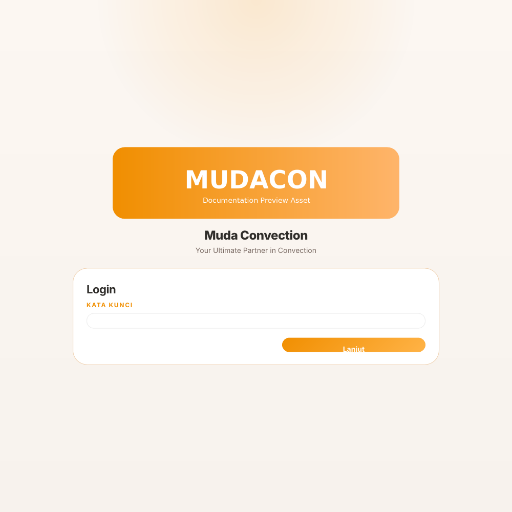
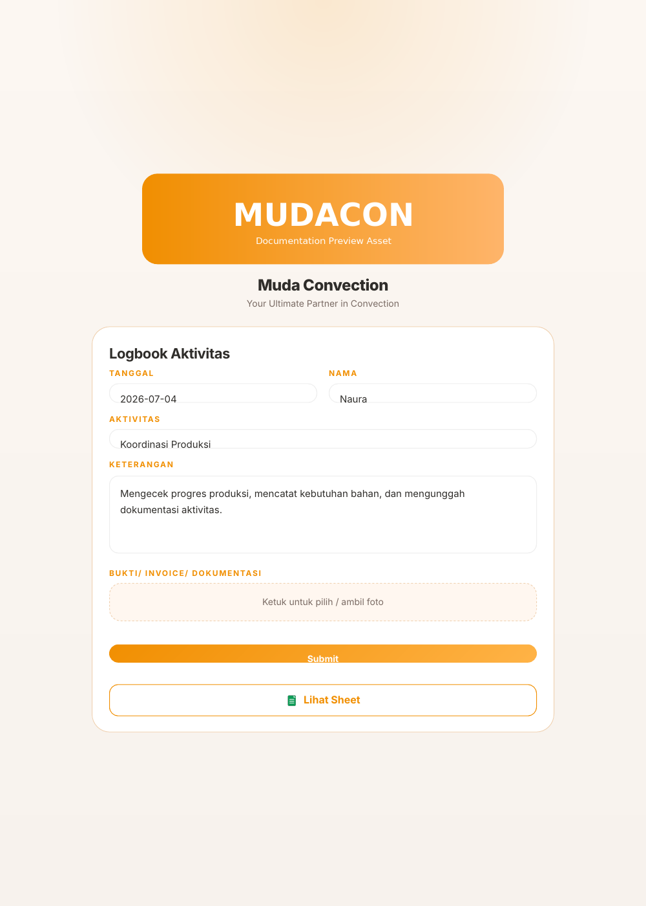
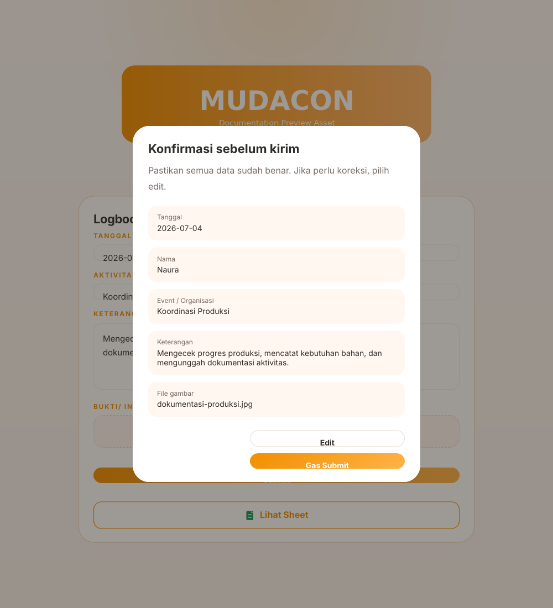
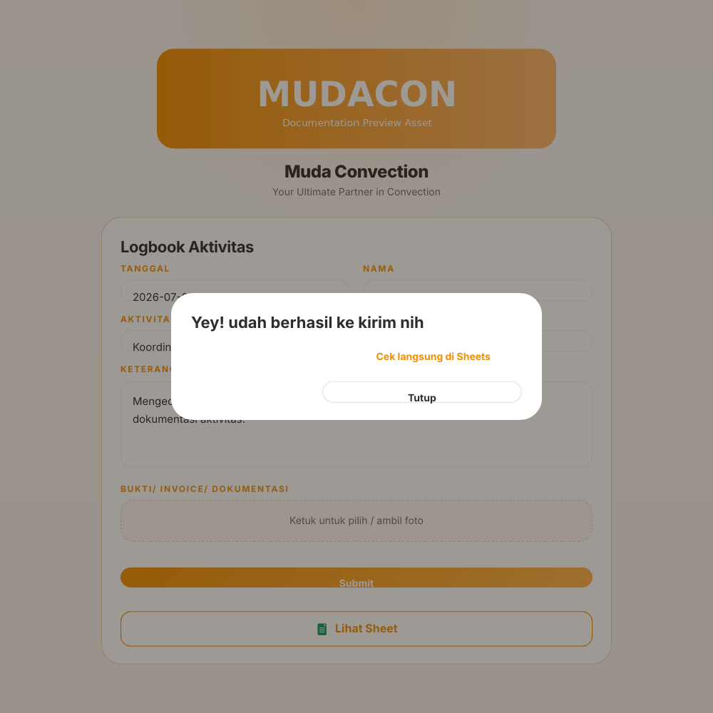

# MudaCon Activity Logbook

Web logbook sederhana untuk mencatat aktivitas Muda Convection. Aplikasi berjalan sebagai **single-page web** berbasis HTML, CSS, dan JavaScript tanpa framework. Data form dikirim ke Google Apps Script, lalu dapat diteruskan ke Google Sheets dan penyimpanan gambar sesuai implementasi backend.

> **Dokumentasi developer:** [Buka dokumentasi teknis lengkap](docs/DEVELOPMENT.md)

## Tujuan aplikasi

Aplikasi ini membantu pengguna untuk:

- masuk menggunakan kata kunci;
- mengisi tanggal, nama, aktivitas, dan keterangan;
- memilih atau mengambil foto dokumentasi;
- memeriksa kembali data melalui modal konfirmasi;
- mengirim data ke Google Apps Script;
- membuka Google Sheets untuk memeriksa hasil pengiriman.

## Alur penggunaan web

1. Pengguna membuka halaman web.
2. Pengguna memasukkan kata kunci pada halaman login.
3. Jika kata kunci salah, web menampilkan pesan kesalahan dan tetap berada di halaman login.
4. Jika kata kunci benar, form logbook ditampilkan.
5. Pengguna mengisi data aktivitas dan dapat menambahkan foto.
6. Saat tombol **Submit** ditekan, web memvalidasi tiga isian wajib: tanggal, nama, dan aktivitas.
7. Jika data wajib lengkap, modal konfirmasi menampilkan ringkasan data.
8. Pengguna dapat memilih **Edit** atau **Gas Submit**.
9. Saat dikonfirmasi, web mengirim payload JSON ke endpoint Google Apps Script.
10. Jika respons berhasil, modal sukses ditampilkan. Jika gagal, pesan error ditampilkan pada form.
11. Setelah modal sukses ditutup, form dikosongkan kembali.

## Flowchart alur web



<details>
<summary>Versi Mermaid</summary>



</details>

## Snapshot antarmuka

> Aset logo resmi tidak terdapat pada file yang diterima. Snapshot di bawah menggunakan placeholder bertuliskan **Documentation Preview Asset**. Tampilan form, warna, ukuran, dan komponen mengikuti kode HTML asli.

### 1. Halaman login



Pengguna memasukkan kata kunci. Tombol **Lanjut** juga dapat dijalankan dengan menekan tombol Enter.

### 2. Form logbook



Form menyediakan tanggal, nama, aktivitas, keterangan, dan unggahan foto. Tombol **Lihat Sheet** membuka Google Sheets pada tab baru.

### 3. Modal konfirmasi



Modal menampilkan ringkasan data sebelum dikirim. Tombol **Edit** menutup modal, sedangkan **Gas Submit** menjalankan proses pengiriman.

### 4. Modal berhasil



Setelah backend mengembalikan `status: "success"`, aplikasi menampilkan modal berhasil. Menutup modal akan mereset form.

## Struktur berkas

```text
mudacon-logbook-docs/
├── index.html
├── README.md
└── docs/
    ├── DEVELOPMENT.md
    └── assets/
        ├── diagrams/
        │   ├── system-architecture.svg
        │   ├── web-flow.png
        │   └── web-flow.svg
        └── screenshots/
            ├── login.png
            ├── form.png
            ├── confirm.png
            └── success.png
```

Agar `index.html` tampil lengkap saat dijalankan, letakkan aset berikut di folder yang sama dengan `index.html`:

```text
logo_mudacon.png
logo_sheets.png
```

## Menjalankan secara lokal

Cara termudah adalah menggunakan static server agar perilaku browser lebih mendekati deployment sebenarnya.

### Menggunakan Python

```bash
python -m http.server 8000
```

Kemudian buka:

```text
http://localhost:8000
```

### Menggunakan VS Code Live Server

1. Buka folder project di VS Code.
2. Pasang extension **Live Server**.
3. Klik kanan `index.html`.
4. Pilih **Open with Live Server**.

## Integrasi data

Frontend mengirim request `POST` ke endpoint yang disimpan pada variabel `APPS_SCRIPT_URL`.

Payload yang dikirim:

```json
{
  "tanggal": "2026-07-04",
  "nama": "Nama pengguna",
  "event": "Nama aktivitas",
  "keterangan": "Deskripsi aktivitas",
  "image": "data:image/jpeg;base64,...",
  "mimeType": "image/jpeg",
  "fileName": "dokumentasi.jpg"
}
```

Respons backend yang dianggap berhasil:

```json
{
  "status": "success"
}
```

Untuk penjelasan payload, fungsi JavaScript, ID elemen, deployment, pengujian, serta rekomendasi keamanan, buka [Dokumentasi Development](docs/DEVELOPMENT.md).

## Catatan penting sebelum dipublikasikan

Kode saat ini cocok sebagai prototipe internal, tetapi belum ideal sebagai autentikasi produksi.

- Kata kunci disimpan di JavaScript frontend dan dapat dilihat melalui source browser.
- Endpoint Apps Script dan tautan Sheet tertanam langsung pada HTML.
- Ringkasan konfirmasi menggunakan `innerHTML` dari input pengguna dan perlu diamankan dari HTML injection.
- Belum ada batas ukuran file, kompresi gambar, maupun pemeriksaan MIME yang ketat.
- Tidak ada session login; refresh halaman akan kembali ke halaman login.

Lihat bagian [Keamanan dan risiko](docs/DEVELOPMENT.md#keamanan-dan-risiko) sebelum deployment publik.
