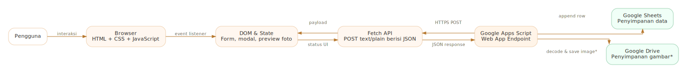
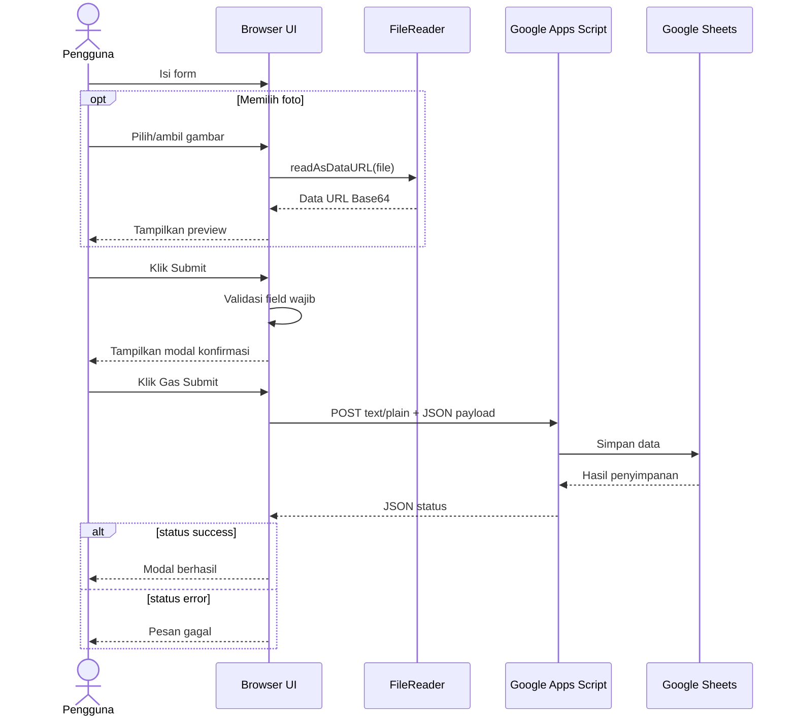

# Dokumentasi Development — MudaCon Activity Logbook

[← Kembali ke README utama](../README.md)

Dokumen ini menjelaskan struktur, alur, fungsi, integrasi, dan risiko teknis pada `index.html`. Target pembaca adalah developer yang akan memelihara, memperbaiki, atau mengembangkan web logbook ini.

## 1. Gambaran arsitektur

Aplikasi menggunakan arsitektur frontend statis dengan satu endpoint backend.



Komponen utama:

1. **Browser** menjalankan HTML, CSS, dan JavaScript.
2. **DOM** menyimpan keadaan halaman melalui class seperti `active` dan `hidden`.
3. **FileReader API** mengubah gambar lokal menjadi Data URL Base64.
4. **Fetch API** mengirim data JSON ke Google Apps Script.
5. **Google Apps Script** diharapkan memproses data, menulis ke Google Sheets, dan jika diperlukan menyimpan gambar.
6. **Google Sheets** menjadi tampilan hasil akhir yang dapat dibuka pengguna.

> Bagian backend Google Apps Script tidak terdapat pada file HTML. Dokumentasi ini hanya menjelaskan kontrak yang terlihat dari sisi frontend.

## 2. Karakteristik implementasi

- Satu file utama: `index.html`.
- Tidak menggunakan framework frontend.
- Tidak menggunakan build system atau package manager.
- CSS ditulis di dalam elemen `<style>`.
- JavaScript ditulis di dalam elemen `<script>`.
- Seluruh JavaScript dibungkus dalam Immediately Invoked Function Expression atau IIFE:

```javascript
(function () {
  // seluruh state, fungsi, dan event listener
})();
```

IIFE mencegah variabel internal langsung masuk ke global scope `window`.

## 3. Struktur dokumen HTML

Struktur halaman secara konseptual:

```text
body
├── #logbook-root
│   ├── .brand-panel
│   │   ├── .brand-mark
│   │   └── .brand-info
│   ├── #screen-login
│   └── #screen-form
├── #confirm-modal
└── #success-modal
```

### 3.1 Brand panel

Bagian ini selalu berada di atas screen aktif.

Elemen penting:

| Elemen | Fungsi |
|---|---|
| `.brand-mark` | Container logo utama. |
| `logo_mudacon.png` | Aset logo MudaCon. |
| `.brand-name` | Menampilkan “Muda Convection”. |
| `.brand-moto` | Menampilkan motto brand. |

### 3.2 Screen login

Container: `#screen-login`

Elemen penting:

| ID | Jenis | Fungsi |
|---|---|---|
| `#login-password` | `input[type=password]` | Menerima kata kunci. |
| `#login-button` | Button | Memvalidasi kata kunci. |
| `#login-status` | Status text | Menampilkan pesan kesalahan login. |

Login tidak menghubungi server. Validasi dilakukan dengan membandingkan input terhadap variabel `PASSWORD` pada browser.

### 3.3 Screen form

Container: `#screen-form`

Elemen form:

| ID | Data | Wajib |
|---|---|---|
| `#lb-tanggal` | Tanggal aktivitas | Ya |
| `#lb-nama` | Nama pengisi | Ya |
| `#lb-event` | Nama aktivitas atau organisasi | Ya |
| `#lb-keterangan` | Uraian aktivitas | Tidak |
| `#lb-foto` | File gambar | Tidak |

Elemen pendukung:

| ID | Fungsi |
|---|---|
| `#lb-photo-box` | Area klik untuk membuka file picker. |
| `#lb-photo-label` | Menampilkan petunjuk atau nama file. |
| `#lb-preview` | Menampilkan preview gambar. |
| `#lb-status` | Menampilkan status validasi atau error request. |
| `#lb-submit` | Membuka modal konfirmasi setelah validasi. |

### 3.4 Modal konfirmasi

Container: `#confirm-modal`

| ID | Fungsi |
|---|---|
| `#confirm-summary` | Menampilkan ringkasan data form. |
| `#edit-button` | Menutup modal agar pengguna dapat mengedit. |
| `#confirm-submit-button` | Mengirim payload ke backend. |

### 3.5 Modal sukses

Container: `#success-modal`

| ID | Fungsi |
|---|---|
| `#close-success-button` | Menutup modal dan mereset form. |
| Tautan Sheets | Membuka Google Sheets pada tab baru. |

## 4. Styling dan desain responsif

### 4.1 Design tokens

Variabel warna disimpan pada `:root`:

```css
:root {
  --bg: #f7f2ed;
  --panel: #ffffff;
  --surface: #fff7f0;
  --border: #f0d2b2;
  --text: #2f2d2a;
  --muted: #7a6b64;
  --brand: #f18f01;
  --brand-soft: #ffb56b;
  --danger: #c94a19;
  --shadow: 0 24px 60px rgba(41,34,27,0.12);
}
```

Untuk mengganti tema brand, prioritaskan perubahan pada variabel tersebut agar warna antar-komponen tetap konsisten.

### 4.2 Layout utama

- `body` menggunakan Flexbox untuk memusatkan aplikasi.
- `#logbook-root` memiliki lebar maksimal `760px`.
- `.lb-row2` menggunakan CSS Grid dua kolom.
- `.screen` menjadi card utama dengan border, radius, dan shadow.

### 4.3 Breakpoint mobile

Breakpoint utama:

```css
@media (max-width: 640px) {
  /* layout mobile */
}
```

Perubahan pada layar kecil:

- Grid dua kolom berubah menjadi satu kolom.
- Padding card diperkecil.
- Brand panel berubah menjadi layout horizontal.
- Logo diperkecil menjadi `120px`.
- Radius modal diperkecil.

## 5. Konfigurasi JavaScript

Konfigurasi utama berada pada awal IIFE:

```javascript
var PASSWORD = '...';
var APPS_SCRIPT_URL = '...';
```

### `PASSWORD`

Digunakan sebagai pembanding kata kunci di browser. Nilainya sengaja tidak disalin ke dokumentasi ini.

**Catatan:** ini hanya penghalang antarmuka, bukan autentikasi aman.

### `APPS_SCRIPT_URL`

Endpoint Google Apps Script Web App yang menerima request `POST`.

Untuk mengganti backend, ubah nilai variabel ini. Pastikan endpoint baru menerima payload yang sama dan mengembalikan JSON.

## 6. State aplikasi

Aplikasi tidak memakai state management library. State dibagi menjadi dua jenis.

### 6.1 State melalui class DOM

- Screen aktif: class `active`.
- Screen tidak aktif: class `hidden`.
- Modal terbuka: class `active` pada `.modal-backdrop`.

### 6.2 State gambar dalam variabel

```javascript
var imageBase64 = null;
var imageMime = null;
var imageName = null;
```

| Variabel | Isi |
|---|---|
| `imageBase64` | Data URL hasil `FileReader.readAsDataURL()`. |
| `imageMime` | MIME type dari file, misalnya `image/jpeg`. |
| `imageName` | Nama file asli. |

State ini direset oleh fungsi `resetForm()`.

## 7. Fungsi helper

### 7.1 `showScreen(screen)`

Tanggung jawab:

1. Menambahkan class `hidden` pada screen login dan form.
2. Menghapus class `hidden` dari screen tujuan.
3. Menambahkan class `active` pada screen tujuan.

Fungsi ini digunakan saat login berhasil.

### 7.2 `setStatus(element, message, type)`

Mengubah teks dan class status.

Contoh hasil class:

```text
lb-status
lb-status err
lb-status ok
```

Parameter `type` saat ini umumnya berisi `err` atau string kosong.

### 7.3 `showModal(modal)` dan `hideModal(modal)`

Mengatur class `active` pada modal.

```javascript
function showModal(modal) {
  modal.classList.add('active');
}

function hideModal(modal) {
  modal.classList.remove('active');
}
```

### 7.4 `resetForm()`

Membersihkan:

- tanggal;
- nama;
- aktivitas;
- keterangan;
- file input;
- state Base64, MIME, dan nama file;
- preview gambar;
- label foto;
- pesan status.

Fungsi dipanggil setelah modal sukses ditutup, bukan langsung setelah respons sukses diterima.

### 7.5 `buildSummaryHtml(...)`

Membentuk lima item ringkasan:

1. tanggal;
2. nama;
3. event/organisasi;
4. keterangan;
5. nama file gambar.

Hasil fungsi dimasukkan ke `confirmSummary.innerHTML`.

**Risiko:** nilai input pengguna dimasukkan ke HTML tanpa escaping. Lihat bagian [Keamanan dan risiko](#keamanan-dan-risiko).

## 8. Event listener dan alur eksekusi

### 8.1 Login dengan tombol

```javascript
loginButton.addEventListener('click', function () {
  // membandingkan input dengan PASSWORD
});
```

Jika cocok:

- form ditampilkan;
- input password dikosongkan;
- pesan login dihapus.

Jika tidak cocok:

- pesan `hmmm kamu mencurigakan!` ditampilkan.

### 8.2 Login dengan Enter

```javascript
loginPassword.addEventListener('keypress', function (event) {
  if (event.key === 'Enter') {
    loginButton.click();
  }
});
```

Untuk implementasi modern, event `keydown` lebih direkomendasikan daripada `keypress` karena `keypress` telah deprecated pada sebagian dokumentasi browser.

### 8.3 Membuka file picker

Klik pada `#lb-photo-box` memanggil:

```javascript
fotoInput.click();
```

Atribut file input:

```html
accept="image/*" capture="environment"
```

Pada perangkat mobile, `capture="environment"` dapat mengarahkan pengguna ke kamera belakang. Perilaku aktual bergantung browser dan sistem operasi.

### 8.4 Membaca dan menampilkan gambar

Saat file berubah:

1. Ambil file pertama dari `fotoInput.files[0]`.
2. Simpan MIME type dan nama file.
3. Gunakan `FileReader` untuk membaca file sebagai Data URL.
4. Simpan hasil ke `imageBase64`.
5. Tampilkan gambar melalui `preview.src`.
6. Tampilkan nama file pada label.

### 8.5 Validasi sebelum konfirmasi

Saat tombol Submit ditekan:

```javascript
if (!tanggal || !nama || !eventName) {
  // tampilkan error
  return;
}
```

Keterangan dan foto tidak diwajibkan.

Jika valid, aplikasi membentuk ringkasan dan membuka modal konfirmasi.

### 8.6 Edit data

Tombol Edit hanya menutup modal konfirmasi. Nilai form tetap tersimpan di DOM.

### 8.7 Mengirim data

Tombol **Gas Submit**:

1. Membaca ulang nilai form terbaru.
2. Menonaktifkan tombol.
3. Mengubah teks tombol menjadi `Mengirim...`.
4. Membentuk payload.
5. Menjalankan `fetch()`.
6. Mengubah respons menjadi JSON.
7. Menangani hasil sukses atau gagal.
8. Mengaktifkan kembali tombol.

## 9. Kontrak request dan response

### 9.1 HTTP request

```text
Method       : POST
Content-Type : text/plain;charset=utf-8
Body         : JSON.stringify(payload)
```

`Content-Type` menggunakan `text/plain`, bukan `application/json`. Pola ini sering dipakai pada integrasi Apps Script untuk menghindari preflight tertentu, tetapi backend tetap harus melakukan parsing JSON terhadap body request.

### 9.2 Payload

```javascript
var payload = {
  tanggal: tanggal,
  nama: nama,
  event: eventName,
  keterangan: keterangan,
  image: imageBase64,
  mimeType: imageMime,
  fileName: imageName
};
```

| Field | Tipe | Dapat `null` | Keterangan |
|---|---|---:|---|
| `tanggal` | string | Tidak | Format input date, umumnya `YYYY-MM-DD`. |
| `nama` | string | Tidak | Sudah di-`trim()`. |
| `event` | string | Tidak | Nama aktivitas, sudah di-`trim()`. |
| `keterangan` | string | Ya secara isi | Dapat berupa string kosong. |
| `image` | string | Ya | Data URL Base64 atau `null`. |
| `mimeType` | string | Ya | MIME file atau `null`. |
| `fileName` | string | Ya | Nama file atau `null`. |

### 9.3 Response sukses

Frontend menganggap request sukses hanya jika JSON response memiliki:

```json
{
  "status": "success"
}
```

Field lain boleh ditambahkan backend tanpa merusak frontend.

### 9.4 Response gagal terkontrol

Contoh respons backend:

```json
{
  "status": "error",
  "message": "Gagal menyimpan data"
}
```

Frontend menampilkan `message` jika tersedia. Jika tidak ada, frontend menampilkan `error tidak diketahui`.

### 9.5 Kegagalan jaringan atau parsing

Semua exception pada rantai Promise masuk ke `.catch()` dan ditampilkan melalui:

```text
Gagal terkirim: <pesan error>
```

## 10. Sequence proses submit



## 11. Tautan Google Sheets

Tautan Sheets muncul pada dua tempat:

1. tombol **Lihat Sheet** pada form;
2. tautan **Cek langsung di Sheets** pada modal sukses.

Kedua tautan saat ini ditulis langsung di HTML. Saat mengganti spreadsheet, perbarui keduanya agar tidak mengarah ke lokasi berbeda.

Rekomendasi refactor: simpan URL pada satu konstanta dan tetapkan `href` melalui JavaScript, atau gunakan templating saat build.

## 12. Aset yang dibutuhkan

`index.html` mengharapkan dua aset pada folder yang sama:

```text
logo_mudacon.png
logo_sheets.png
```

Tanpa file tersebut, browser akan menampilkan broken image atau alt text.

Rekomendasi struktur:

```text
project/
├── index.html
└── assets/
    └── images/
        ├── logo_mudacon.png
        └── logo_sheets.png
```

Jika struktur diubah, perbarui atribut `src` pada HTML.

## 13. Menjalankan dan melakukan debug

### 13.1 Static server

```bash
python -m http.server 8000
```

Buka `http://localhost:8000`.

Hindari hanya mengandalkan double-click file HTML, karena origin `file://` dapat memiliki perilaku berbeda untuk request jaringan.

### 13.2 Browser DevTools

Gunakan tab berikut:

- **Console** untuk error JavaScript atau JSON parsing.
- **Network** untuk melihat request ke Apps Script.
- **Payload/Request** untuk memeriksa data yang dikirim.
- **Response** untuk memastikan backend mengembalikan JSON.
- **Application** untuk memeriksa bahwa tidak ada session atau local storage yang digunakan.

### 13.3 Checklist debug submit

1. Pastikan `APPS_SCRIPT_URL` benar.
2. Pastikan deployment Apps Script masih aktif.
3. Pastikan izin Web App mengizinkan pengguna target.
4. Pastikan respons menggunakan JSON valid.
5. Pastikan field `status` bernilai `success` saat berhasil.
6. Periksa ukuran payload jika foto besar.
7. Periksa Console untuk CORS, network error, atau JSON parse error.

## 14. Deployment

Frontend dapat ditempatkan pada static hosting seperti GitHub Pages, Netlify, Vercel static, Cloudflare Pages, atau hosting biasa.

### Persyaratan frontend

- `index.html` tersedia melalui HTTPS untuk deployment publik.
- Kedua file logo ikut dipublikasikan.
- Endpoint Apps Script dapat diakses dari origin hosting.
- Tautan Google Sheets memiliki permission sesuai kebutuhan.

### Persyaratan Apps Script

Secara konseptual backend harus:

1. menerima body `POST`;
2. membaca `e.postData.contents`;
3. melakukan `JSON.parse()`;
4. memvalidasi field;
5. menyimpan data ke Sheet;
6. jika ada gambar, memisahkan metadata Data URL dan Base64;
7. menyimpan gambar ke Drive atau storage lain;
8. mengembalikan JSON dengan field `status`.

Contoh bentuk respons Apps Script:

```javascript
return ContentService
  .createTextOutput(JSON.stringify({ status: 'success' }))
  .setMimeType(ContentService.MimeType.JSON);
```

## 15. Keamanan dan risiko

### 15.1 Password berada di frontend — risiko tinggi

`PASSWORD` tersedia dalam source JavaScript dan dapat dilihat siapa pun yang membuka DevTools atau mengunduh HTML.

Dampak:

- tidak dapat dianggap sebagai autentikasi;
- siapa pun yang mengetahui endpoint dapat melewati halaman login;
- perubahan password mengharuskan redeploy frontend.

Rekomendasi:

- pindahkan autentikasi ke server;
- gunakan akun pengguna, session, token, atau Google Sign-In;
- validasi hak akses kembali pada backend;
- jangan mengandalkan penyembunyian source.

### 15.2 HTML injection pada modal konfirmasi — risiko tinggi

`buildSummaryHtml()` menggabungkan input pengguna menjadi string HTML, lalu memasukkannya melalui `innerHTML`.

Input seperti berikut dapat diperlakukan sebagai markup:

```html

```

Perbaikan yang disarankan: buat node DOM dan gunakan `textContent`.

```javascript
function appendSummaryItem(list, label, value) {
  const item = document.createElement('li');
  const labelElement = document.createElement('span');

  labelElement.textContent = label;
  item.appendChild(labelElement);
  item.appendChild(document.createTextNode(value || '-'));
  list.appendChild(item);
}
```

Kemudian kosongkan list dengan `replaceChildren()` dan tambahkan item satu per satu.

### 15.3 Endpoint dan Sheet URL terlihat publik

Endpoint Apps Script dan Sheet URL berada pada source HTML.

Backend wajib:

- melakukan autentikasi atau verifikasi token;
- memvalidasi seluruh input;
- menerapkan rate limit jika memungkinkan;
- membatasi hak akses deployment;
- tidak menganggap request dari frontend selalu tepercaya.

### 15.4 Tidak ada validasi ukuran gambar

Gambar dibaca seluruhnya ke memori dan dikirim sebagai Base64. Base64 menambah ukuran data dibanding file biner asli.

Risiko:

- browser lambat atau kehabisan memori pada file besar;
- request melewati batas Apps Script;
- waktu unggah panjang;
- Apps Script timeout.

Tambahkan batas ukuran sebelum `FileReader`:

```javascript
const MAX_FILE_SIZE = 5 * 1024 * 1024;

if (file.size > MAX_FILE_SIZE) {
  setStatus(statusEl, 'Ukuran gambar maksimal 5 MB.', 'err');
  fotoInput.value = '';
  return;
}
```

Pertimbangkan kompresi gambar menggunakan Canvas sebelum dikirim.

### 15.5 Validasi MIME hanya di browser

`accept="image/*"` membantu UI file picker, tetapi bukan kontrol keamanan. Backend tetap harus memvalidasi MIME, ekstensi, dan isi file.

### 15.6 Tidak ada proteksi double submit lintas state

Tombol konfirmasi memang dinonaktifkan saat request berlangsung, tetapi:

- tidak ada idempotency key;
- refresh atau request ulang dapat membuat data duplikat;
- backend perlu mendeteksi atau mengelola duplikasi bila penting.

### 15.7 Tidak ada session

Login hanya mengubah screen. Refresh akan mengembalikan UI ke login. Ini bukan bug jika memang diinginkan, tetapi perlu diketahui developer.

## 16. Rekomendasi refactor

Untuk project yang berkembang, pecah single file menjadi:

```text
project/
├── index.html
├── assets/
│   └── images/
├── css/
│   └── styles.css
└── js/
    ├── config.js
    ├── ui.js
    ├── api.js
    └── app.js
```

Pembagian tanggung jawab:

| File | Tanggung jawab |
|---|---|
| `styles.css` | Semua style dan responsive layout. |
| `config.js` | Endpoint dan konfigurasi non-rahasia. |
| `ui.js` | Screen, modal, status, preview, reset form. |
| `api.js` | Pembuatan payload dan request fetch. |
| `app.js` | Event listener dan orkestrasi aplikasi. |

**Penting:** memindahkan password ke `config.js` tetap tidak membuatnya rahasia. Secret harus berada di server.

## 17. Rekomendasi peningkatan UX

- Isi tanggal otomatis dengan tanggal hari ini.
- Tambahkan indikator ukuran dan format gambar.
- Tambahkan progress upload.
- Tambahkan tombol hapus/ganti foto.
- Fokuskan kursor ke field pertama yang invalid.
- Tutup modal dengan tombol Escape.
- Tambahkan `aria-live` pada status error.
- Tambahkan label loading yang lebih informatif.
- Cegah kehilangan data saat pengguna menutup tab ketika form sudah terisi.
- Tampilkan ID atau timestamp hasil submit untuk pelacakan.

Contoh mengisi tanggal hari ini:

```javascript
const dateInput = document.getElementById('lb-tanggal');
dateInput.value = new Date().toISOString().slice(0, 10);
```

Perhatikan zona waktu jika tanggal lokal harus akurat di sekitar tengah malam.

## 18. Accessibility

Hal yang sudah baik:

- field utama memiliki elemen `<label>` dengan atribut `for`;
- tombol menggunakan elemen `<button>`;
- gambar memiliki atribut `alt`;
- warna fokus input terlihat.

Peningkatan yang disarankan:

- beri `role="dialog"` dan `aria-modal="true"` pada modal;
- hubungkan modal dengan judul menggunakan `aria-labelledby`;
- pindahkan fokus ke modal saat dibuka;
- kembalikan fokus ke tombol sebelumnya saat modal ditutup;
- jebak fokus di dalam modal;
- tambah `aria-live="polite"` atau `assertive` pada status;
- pastikan kontras warna memenuhi WCAG;
- sediakan mekanisme keyboard untuk area upload.

Area upload saat ini berupa `<div>` yang dapat diklik tetapi tidak otomatis dapat difokuskan dengan keyboard. Solusi lebih baik adalah menggunakan `<label for="lb-foto">` atau menambah `tabindex="0"` dan handler keyboard.

## 19. Pengujian manual

### 19.1 Login

- [ ] Kata kunci benar membuka form.
- [ ] Kata kunci salah menampilkan error.
- [ ] Enter menjalankan login.
- [ ] Password dikosongkan setelah login sukses.

### 19.2 Form

- [ ] Submit tanpa tanggal ditolak.
- [ ] Submit tanpa nama ditolak.
- [ ] Submit tanpa aktivitas ditolak.
- [ ] Keterangan boleh kosong.
- [ ] Foto boleh kosong.
- [ ] Nama file tampil setelah memilih foto.
- [ ] Preview gambar tampil dengan benar.

### 19.3 Modal konfirmasi

- [ ] Semua field ringkasan sesuai form.
- [ ] Tombol Edit menutup modal tanpa menghapus data.
- [ ] Tombol Gas Submit berubah menjadi loading.
- [ ] Tombol tidak dapat ditekan berulang saat request berlangsung.

### 19.4 Integrasi backend

- [ ] Payload tanpa gambar diterima backend.
- [ ] Payload dengan gambar diterima backend.
- [ ] Response sukses membuka modal sukses.
- [ ] Response error menampilkan `message`.
- [ ] Response non-JSON masuk ke error handler.
- [ ] Network offline menampilkan error yang dapat dipahami.

### 19.5 Reset

- [ ] Menutup modal sukses mengosongkan semua field.
- [ ] Preview gambar disembunyikan.
- [ ] State file dikembalikan menjadi `null`.
- [ ] Pesan status dihapus.

### 19.6 Responsive

- [ ] Layout desktop bekerja di atas 640px.
- [ ] Layout mobile bekerja pada 640px atau kurang.
- [ ] Modal tidak keluar layar.
- [ ] Tombol dapat ditekan pada perangkat sentuh.
- [ ] Kamera belakang dapat dibuka pada perangkat yang mendukung.

## 20. Pengujian otomatis yang disarankan

Jika project mulai kritis, gunakan Playwright atau Cypress untuk skenario:

1. login benar dan salah;
2. validasi field wajib;
3. preview file;
4. modal konfirmasi;
5. mocking respons sukses dan gagal dari Apps Script;
6. reset form;
7. viewport desktop dan mobile.

Pisahkan fungsi seperti `createPayload()` dan validator agar dapat diuji sebagai unit test tanpa browser penuh.

## 21. Peta perubahan umum

| Kebutuhan | Lokasi perubahan |
|---|---|
| Mengubah warna utama | Variabel `--brand` dan `--brand-soft` pada `:root`. |
| Mengubah logo | File `logo_mudacon.png`. |
| Mengubah ikon Sheets | File `logo_sheets.png`. |
| Mengubah teks brand | `.brand-name` dan `.brand-moto`. |
| Mengubah field form | HTML form, validasi, summary, dan payload. |
| Mengubah field wajib | Handler `submitBtn`. |
| Mengubah endpoint | Variabel `APPS_SCRIPT_URL`. |
| Mengubah link Sheet | Dua atribut `href` pada HTML. |
| Mengubah respons sukses | Kondisi `data.status === 'success'`. |
| Mengubah breakpoint | `@media (max-width: 640px)`. |
| Mengubah batas lebar | `#logbook-root` dan `.modal-card`. |

## 22. Menambah field baru

Contoh: menambah field `divisi`.

Langkah yang harus dilakukan:

1. Tambahkan input HTML dan ID, misalnya `lb-divisi`.
2. Ambil nilainya saat tombol Submit ditekan.
3. Tentukan apakah field wajib.
4. Tambahkan ke modal konfirmasi.
5. Ambil ulang nilainya saat konfirmasi submit.
6. Tambahkan ke payload.
7. Perbarui Apps Script agar membaca dan menyimpan field.
8. Perbarui header Google Sheets.
9. Tambahkan pengujian.
10. Perbarui dokumentasi kontrak payload.

Jangan hanya menambah input pada HTML karena field tidak otomatis terkirim.

## 23. Known behavior

- Form tetap berisi data jika request gagal.
- Form baru direset setelah pengguna menutup modal sukses.
- Tombol Sheets dapat dibuka sebelum atau sesudah submit.
- Login tidak tersimpan setelah refresh.
- Satu file gambar saja yang diproses.
- Preview memakai Data URL yang sama dengan data yang dikirim.
- Tidak ada timeout khusus pada `fetch()`.
- Tidak ada retry otomatis.
- Tidak ada offline queue.

## 24. Prioritas perbaikan

Urutan yang disarankan sebelum penggunaan publik:

1. Pindahkan autentikasi dan otorisasi ke backend.
2. Hapus penggunaan `innerHTML` untuk input pengguna.
3. Tambahkan validasi backend untuk semua field dan file.
4. Tambahkan batas ukuran dan kompresi gambar.
5. Pisahkan HTML, CSS, dan JavaScript.
6. Tambahkan logging dan identifier submit.
7. Tambahkan automated test.
8. Tambahkan aksesibilitas modal dan upload area.
9. Satukan konfigurasi URL Sheet agar tidak duplikat.
10. Dokumentasikan dan versioning Apps Script.

---

[← Kembali ke README utama](../README.md)
